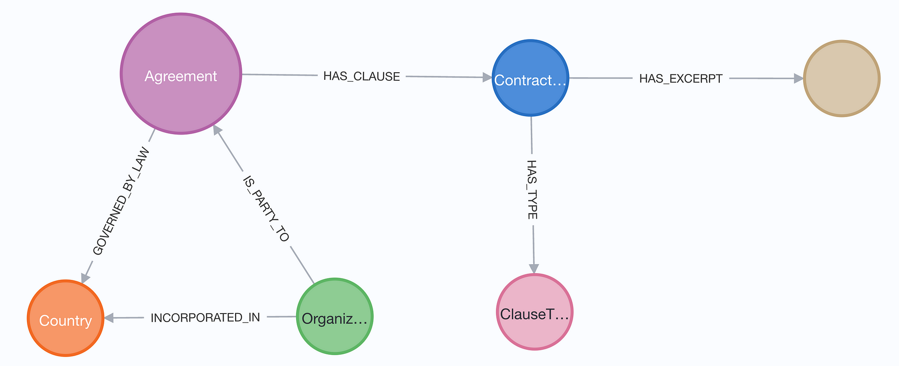
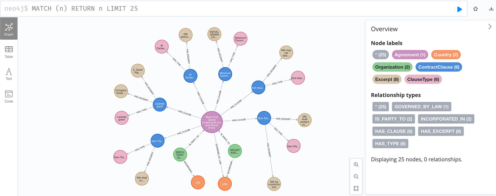
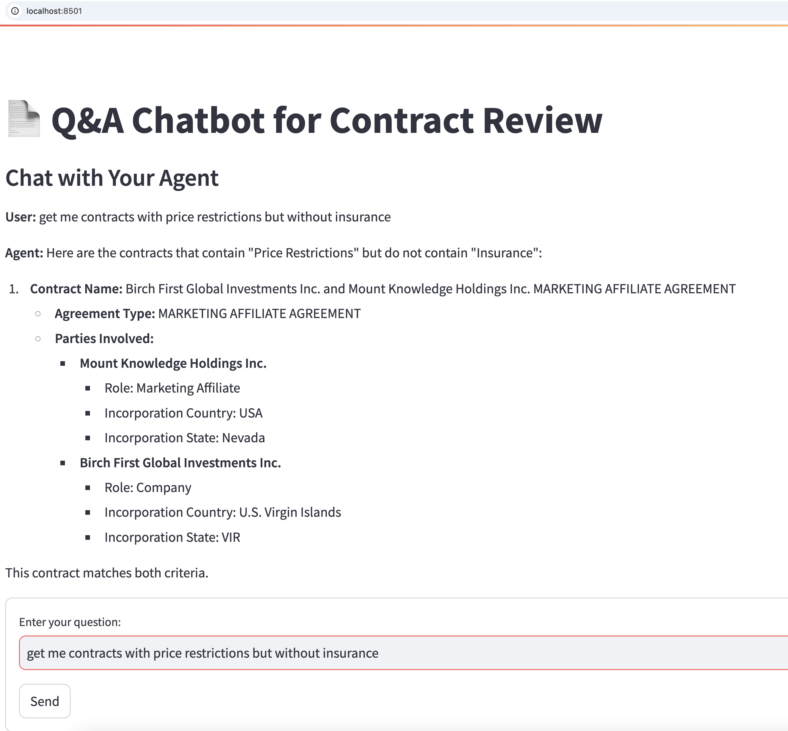

# GraphRAG in Commercial Contract Review

This repository contains all of the code mentioned in [GraphRAG in Commercial Contract Review](https://medium.com/@edward.sandoval.2000/graphrag-in-commercial-contract-review-7d4a6caa6eb5).


## Contract Review - GraphRAG-based approach
The GraphRAG-based approach described in the blog post goes beyond the traditional chunk-based RAG, focusing instead on targeted information extraction from the contracts (LLM + Prompt) to create a knowledge graph representation (LLM + Neo4J), a simple set of data retrieval functions (in Python using Cypher, Text to Cypher, Vector Search retrievers) and ultimately a Q&A agent (Semantic Kernel) capable of handling complex questions

The diagram below illustrates the approach


The four steps are:
- Extracting Relevant Information from Contracts (LLM + Contract)
- Storing information extracted into a Knowledge Graph (Neo4j)
- Developing simple KG Data Retrieval Functions (Python)
- Building a Q&A Agent handling complex questions (Semantic Kernel, LLM, Neo4j)

# What Do You Need?
- Obtain an [OpenAI token](https://platform.openai.com/api-keys). It will be used to:
    - Build the Q&A agent with Semantic Kernel
    - Extract specific information from contracts (parties,key dates,jurisdiction)
    - Generate embeddings for a small number of contract excerpts
    - Power a Text2Cypher data retrieval function
- Python 3.9+ and a Python virtual environment
- Access to a Neo4j database
    - Docker, Aura or Self-hosted
    - GenAI plugin running on the database (This is automatically available in Aura)

# Set Up
- Clone the repo
``` 
git clone https://github.com/neo4j-product-examples/graphrag-contract-review.git
cd graphrag-contract-review
```
- Create a Python Virtual environment
```
python3 -m venv .venv
source .venv/bin/activate
pip install -r requirements.txt
```
- Run a local Neo4j instance (Optional)
We will use Docker  

But you can use an Aura or self-hosted Neo4j instance.
If you do so,  you can skip this step. Just make sure you have URL, user name and password to access your Neo4j database

```
docker run \
    --restart always --env NEO4J_AUTH=neo4j/yourpassword \
    --publish=7474:7474 --publish=7687:7687 \
    --env NEO4J_PLUGINS='["genai","apoc"]'  neo4j:latest
```

Make sure you replace **yourpassword** with a password to access this database

## Set up some environment vars
If you are using Neo4j Aura or self-hosted instance
```
export NEO4J_URI=<URI to your db>
export NEO4J_USERNAME=<your_username>
```
If you are using Docker, you need to specify URI or Username ONLY if different from the default

You need to specify the password to access the database
```
export NEO4J_PASSWORD=<your_password>
```

Set your OpenAI API  Key 
```
export OPENAI_API_KEY=sk-....
```


# STEP 1: Extracting Relevant Information from Contracts (LLM + Contract)
In the [data](./data/input) folder, you will find 3 real commercial contracts in PDF format

These contracts were taken from the publicly available [Contract Understanding Atticus Dataset](https://www.atticusprojectai.org/cuad)

Our first step is to run a program that will prompt a ```OpenAI gpt-4o``` model to answer 40+ questions for each contract.

The prompt will include instructions to store the extracted information in JSON format, under [data/output](./data/output)

The full prompt can be found [here](./prompts/contract_extraction_prompt.txt)

## From PDF Contract to JSON
Run the following command
```
python convert-pdf-to-json.py
```
Each PDF will take around 60s to process

You can check out any of the [json files generated under the data/output folder](./data/output/)

In case the LLM generates invalid JSON, you can find the infomration returned by the LLM under [data/debug](./data/debug/) folder

# STEP 2: Storing information extracted into a Knowledge Graph (Neo4j)
With each contract as a JSON file, the next step is to create a Knowledge Graph in Neo4j

Before we can do that, we need to design a Knowledge Graph Data model suitable to represent the information extracted from the contracts

## A Suitable KG Data Model for our contracts

In our case, a suitable KG data model includes our main entities: Agreements (contracts), their clauses, the Parties( organizations) to the contracts and the relationships amongst all of them



## Some useful properties for each of the main nodes and relationships
```
Agreement {agreement_type: STRING, contract_id: INTEGER,
          effective_date: STRING,
          renewal_term: STRING, name: STRING}
ContractClause {name: STRING, type: STRING}
ClauseType {name: STRING}
Country {name: STRING}
Excerpt {text: STRING}
Organization {name: STRING}

Relationship properties:
IS_PARTY_TO {role: STRING}
GOVERNED_BY_LAW {state: STRING}
HAS_CLAUSE {type: STRING}
INCORPORATED_IN {state: STRING}
```

Now, let's create a Knowledge Graph from the JSON files in ```./data/output/*.json```

```
 python create_graph_from_json.py
```
The ```create_graph_from_json``` Python script is relatively straightforward to understand. 

The main area of complexity is the ```CREATE_GRAPH_STATEMENT```. This [CYPHER statement](./create_graph_from_json.py#L7) that takes a Contract JSON and creates the relevant nodes and relationships for that contract in Neo4j. 

You can check out the original [blog post](https://medium.com/@edward.sandoval.2000/graphrag-in-commercial-contract-review-7d4a6caa6eb5) for a full breakdown of this CYPHER statement


You will see output similar to 
```
Index excerptTextIndex created.
Index agreementTypeTextIndex created.
Index clauseTypeNameTextIndex created.
Index clauseNameTextIndex created.
Index organizationNameTextIndex created.
Creating index: contractIdIndex
Generating Embeddings for Contract Excerpts...
```

The generation of embeddings takes about 1 minute(s) to complete

After the Python script finishes:
- Each Contract JSON has been uploaded to Neo4J Knowledge Graph
- Key properties on the Agreement, ClauseTypes, Organization (Party) have fulltext indexes
- A new property Excerpt.embedding was generated by using ```genai.vector.encode(excerpt.text)```
    - This calls out OpenAI Text Embedding model ```text-embedding-3-small```
- A new vector index for Excerpt.embedding is created


The total number of Excerpt embeddings for the 3 contracts is between 30-40 (depending on how many relevant excerpts were detected by the LLM on Step 1)

A visual representation of one of the contracts in the Knowledge Graph is



If you are using Docker to run your Neo4j instance, you can use the [browser tool](http://localhost:7474/browser/) to confirm your data was loaded

If you are using Aura or a self-hosted Neo4j instance, you can use the Query tool from the [new Neo4j console](https://console-preview.neo4j.io/tools/query). You may need to log into your Aura instance or manually add a connection to your self-hosted database


# STEP 3: Developing simple KG Data Retrieval Functions (Python)
With the contracts now represented in a Knowledge Graph, the next step is to build some basic data retrieval functions. 

These functions are fundamental building blocks that enable us to build a Q&A agent in the next section

Let's define a few basic data retrieval functions:

- Retrieve basic details about a contract (given a contract ID)
- Find contracts involving a specific organization (given a partial organization name)
- Find contracts that DO NOT contain a particular clause type
- Find contracts contain a specific type of clause
- Find contracts based on the semantic similarity with the text (Excerpt) in a clause (e.g., contracts mentioning the use of "prohibited items")
- Run a natural language query against all contracts in the database. For example, an aggregation query that counts "how many contracts in the database ".

You are encouraged to explore [ContractPlugin.py](./ContractPlugin.py) for a definition and [ContractService.py](./ContractService.py) for the implementation of each of the data retrieval functions

The original [blog post](https://medium.com/@edward.sandoval.2000/graphrag-in-commercial-contract-review-7d4a6caa6eb5) provides a walk through of three different styles of data retrieval functions
- Cypher-based data retrieval functions -
    -  ```get_contract(self, contract_id: int) -> Annotated[Agreement, "A contract"]:```  
    -  ```get_contracts_without_clause(self, clause_type: ClauseType) -> List[Agreement]:```
    - Both of these data retrieval are built around simple CYPHER statements
- Vector-Search + Graph traversal data retrieval function  
    - ```get_contracts_similar_text(self, clause_text: str) -> Annotated[List[Agreement], "A list of contracts with similar text in one of their clauses"]:```
    - This function leverages [Neo4j GraphRAG package](https://github.com/neo4j/neo4j-graphrag-python)
    - It also relies on a vector index defined on "Exceprt" nodes
- Text-to-Cypher (T2C) data retrieval function
    -  ```answer_aggregation_question(self, user_question: str) -> Annotated[str, "An answer to user_question"]:```
    - This function leverages [Neo4j GraphRAG package](https://github.com/neo4j/neo4j-graphrag-python)
    - It uses OpenAI ```gpt-4o``` to generate CYPHER statement that will be executed against the database


# STEP 4: Building a Q&A Agent handling complex questions (Semantic Kernel, LLM, Neo4j)

Armed with our Knowledge Graph data retrieval functions, we are ready to build an agent grounded by GraphRAG!

We will use Microsoft Semantic Kernel, a framework that allows developers to integrate LLM function calling with existing APIs and data retrieval functions 

The framework uses a concept called ```Plugins``` to represent specific functionality that the kernel can perform. In our case, all of our data retrieval functions defined in the "ContractPlugin" can be used by the LLM to answer questions about contracts in the Neo4J database

The framework uses the concept of ```Memory``` to keep all interactions between user and agent, as well as functions executed and data retrieved

An extremely simple Terminal-based agent can be implemented with a few lines of code. 


Run
```
python test_agent.py
```
You can try variations of the following questions to exercise the different data retrieval functions

- Get me contracts with Price Restrictions but without Insurance 
    - See the logging INFO and notice how this requires calling 2 of our data retrieval functions
- Get more details about this contract
- Get me contracts for AT&T 
- Get me contracts for Mount Knowledge
- Get me contract 3
- Get me contracts that mention 100 units of product
- What's the average number of excerpts per contract?

You can type ```**exit``` to finish your session with the agent

You can see the full code of the [test_agent.py](./test_agent.py)
You will find functions that exercise each of the retrieval functions (commented out)

For a nicer-looking UI, you can try on streamlit
```
streamlit run app.py
```
The browser shows




# Acknowledgements - Contract Understanding Atticus Dataset

This demo was made possible thanks to the invaluable resource provided by the Contract Understanding Atticus Dataset (CUAD) v1. 


A dataset curated and maintained by The Atticus Project.  CUAD's extensive corpus of over 13,000 labels in 510 commercial legal contracts, manually annotated under the supervision of experienced lawyers, has been instrumental in identifying critical legal clauses for contract review, particularly in corporate transactions such as mergers and acquisitions.

We recognize and appreciate CUAD's contribution to advancing NLP research and development in the field of legal contract analysis.


# Future Improvements
In this demo, we didn't fine-tune the LLM to enhace its basic capabilities to identify relevant excerpts.

The CUAD does provide the labelled clauses/excerpts that could be used to fine-tune a model to recognize the presence/absence of these clauses


